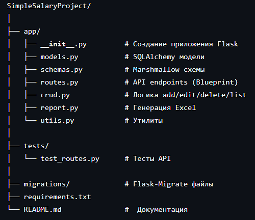

# Flask CRUD + Excel API

Этот проект — REST API на Flask для управления записями в таблице с поддержкой:  
- Добавления, редактирования, удаления и листинга данных  
- Скачивания данных в Excel  

## Стек технологий

- **Python** – язык программирования  
- **Flask** — веб-фреймворк  
- **SQLAlchemy** — работа с БД  
- **Flask-Migrate** — миграции  
- **Marshmallow** — валидация данных  
- **Pandas** — генерация Excel  
- **pytest / unittest** — тестирование API  

## Установка и запуск

1. Клонируй репозиторий:  
```bash
git clone https://github.com/ldrmomentpro/SimpleSalaryProject.git
```
Установи зависимости:

```bash
pip install -r requirements.txt
```
Создай базу данных и сделай миграции:

```bash
flask db init
flask db migrate -m "initial"
flask db upgrade
```
Запусти сервер:

```bash
flask run
```
API будет доступно по адресу:

http://127.0.0.1:5000/

Примеры API запросов

Добавление записи
- POST http://127.0.0.1:5000/records/add

Редактирование записи
- PUT http://127.0.0.1:5000/records/edit/<id>

Удаление записи
- DELETE http://127.0.0.1:5000/records/delete/<id>

Получение списка всех записей
- GET http://127.0.0.1:5000/records/list

Скачивание данных в Excel
- GET http://127.0.0.1:5000/records/download
  
С фильтрацией по возрасту:
- GET http://127.0.0.1:5000/records/download?age=<int:age>
  
  Запуск тестов
```bash
pytest -v
```

Структура проекта


